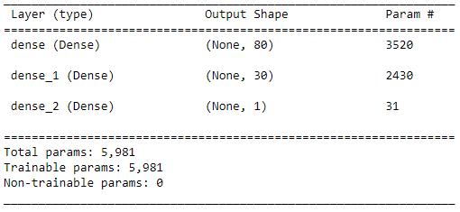
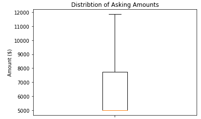

# Neural_Network_Charity_Analysis
## Overview
The goal of this report is to build a deep machine learning model to predict if applications will be successful if funded. We will train the model by using funding information from around 34,000 applicants over the past couple years. The data includes many aspects of a funding application. A couple examples are: type of organization requesting funding, what the money is being used for, and how much the applicant is asking for. The goal is to achieve a target predictive accuracy of 75% or higher.

## Resources
Software Used: Visual Studio Code 1.71.2, Anaconda 2022.05, Jupyter Notebook 6.4.8, Python 3.7.13 
Python Libraries: [sklearn](https://scikit-learn.org/stable/), [pandas](https://pandas.pydata.org/docs/), [tensorflow](https://www.tensorflow.org/), [keras_tuner](https://keras.io/keras_tuner/), [matplotlib](https://matplotlib.org/), <a href="https://pandas.pydata.org/docs/" target="_blank">pandas II</a>

## Results
### Data Preprocessing
- Feature(s): Application Type, Sector of Affiliation, Government Classification, Funding Use Case, Organization Type, status of application, income classification, Any Special Considerations, and Funding Amount Requested. 
    - Variables the model is using to make its classification prediction
- Target(s): Whether or not the Application is successful. 
    - Variable the model is attempting to predict
- Variable(s): EIN # and Name of Applicant.
    - Other variables that the model does not take into account

### Compiling, Training, and Evaluating Model
Using the tensorflow library in python we created a deep learning neural network. The model compiled by with minimizing the binary crossentropy loss function, optimized with "adam", and measured based on accuracy.
#### Building Neural Network
The initial model used three layers. 
1. Input Layer with 80 neurons and a rectified linear unit(ReLu) activation function.
2. Single Dense Layer with 30 neurons and a ReLu activation function.
3. Output layer that has 1 neuron and a sigmoid activation function.

See summary of this model below:

> Initial Model Summary

The results of this model were as follows:
- Accuracy Score: 72.94%
- Loss Metric: 0.557
#### Increasing Model Performance
I tweaked several hyperparameters and adjusted some of the input in the hopes of getting a higher accuracy score. I was able to achieve a higher performace, but not above the target of 75%.

The first method I tried was the number of hidden layers, neurons per hidden layer, and activation functions. I used the keras tuner to find the best possible combination of neurons and hidden layers within a given range. I choose 1 or 2 additional dense layers, between 20-80 neurons per layer, and the ReLu, tanh, and sigmoid activation functions. 

Upon testing this the tuner lead me to the following choice:
- Four total layers. 1 Input, 2 Dense, and 1 Output Layer
- 80, 60, and 60 total neurons for each respective layer
- Tanh as the activation function used for each non-output layer

The results of the attempted optimized model was very similar:
- Accuracy Score: 72.96%
- Loss Metric: 0.556

And lastly I engineered some of the data to capture the large outliers from the asking amount category. The majority of the asking amounts was for $5,000, but there were some were above 1 million dollars asked. I created a boxplot of the non outlier asking amounts to get a better picture of the distribution:

> Distribution of Asking Amounts

From this distribution I binned the asking amount into the following categories:
- $5,000 or less
- $5,001 - $7,500
- $7,501 - $12,00
- $12,000+

Using these new bins I ran the opitimized model again and got the following results:
- Accuracy Score: 73.05%
- Loss Metric: 0.553

## Summary
With each small iteration I was able to increase the accuracy score and decrease the loss metric. However, the optimized deep learning model was not able to predict with at least 75% accuracy. Adjusting the actiavtions functions, the number of neurons per layer, the number of dense layers did not have a large positive effect on the accuracy of the model. 

It might be the case that a different classification model would have more success. Another example would be the random forest classifier. A decision tree might have better predictive capacity for applicant funding success. 

